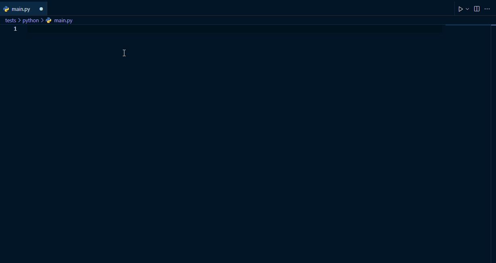
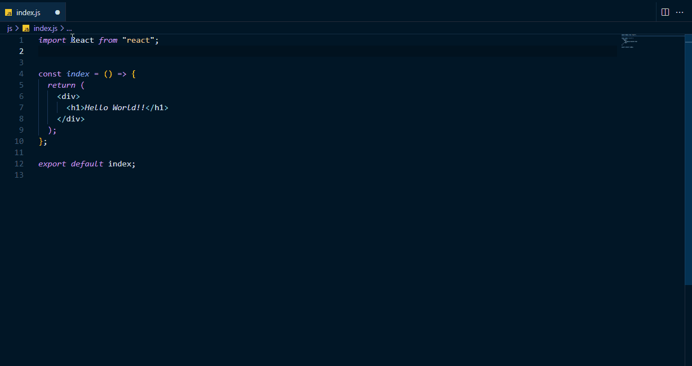
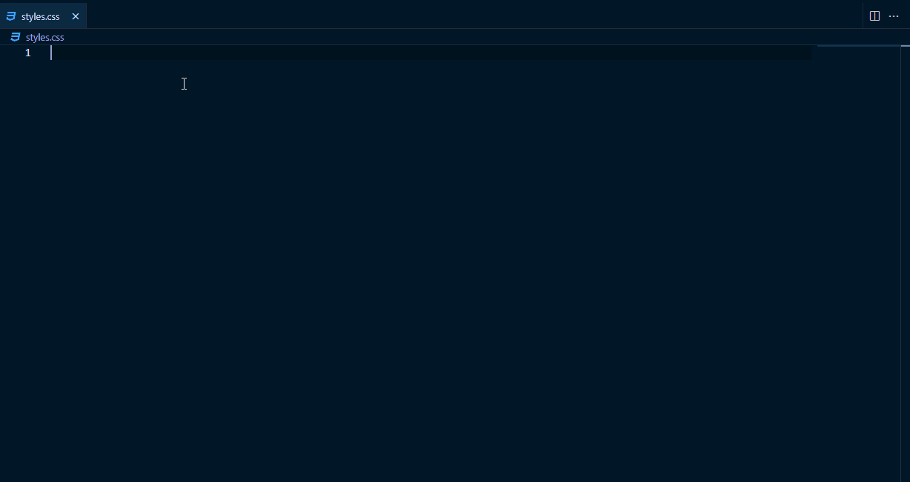
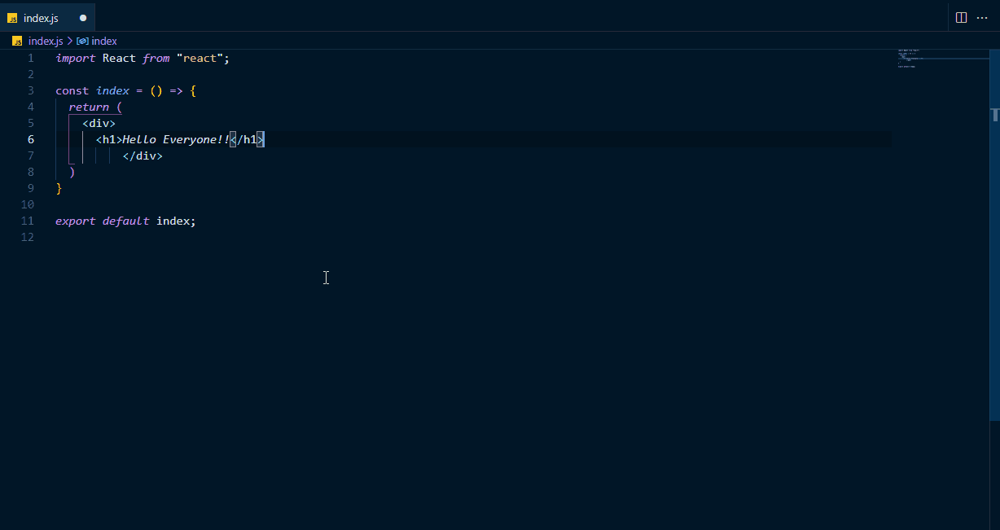
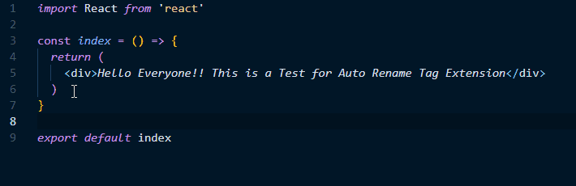
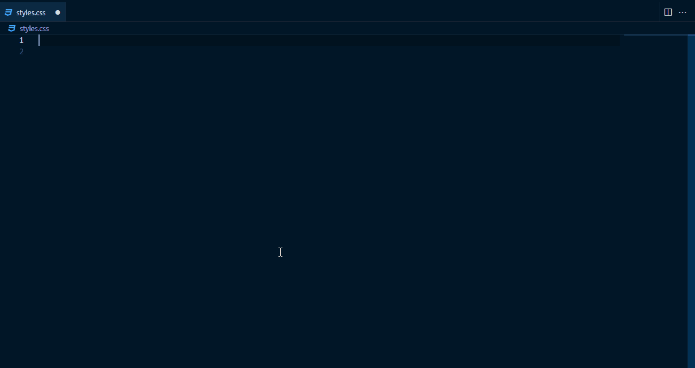
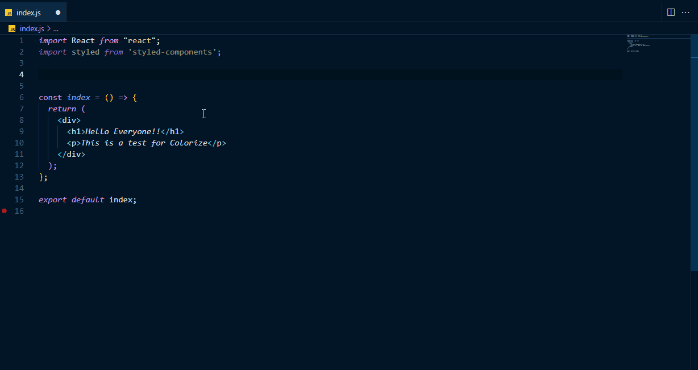
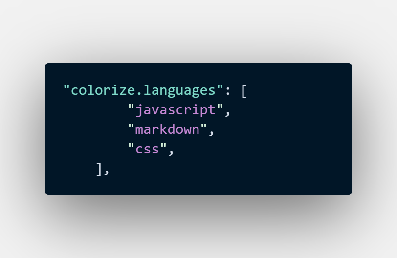
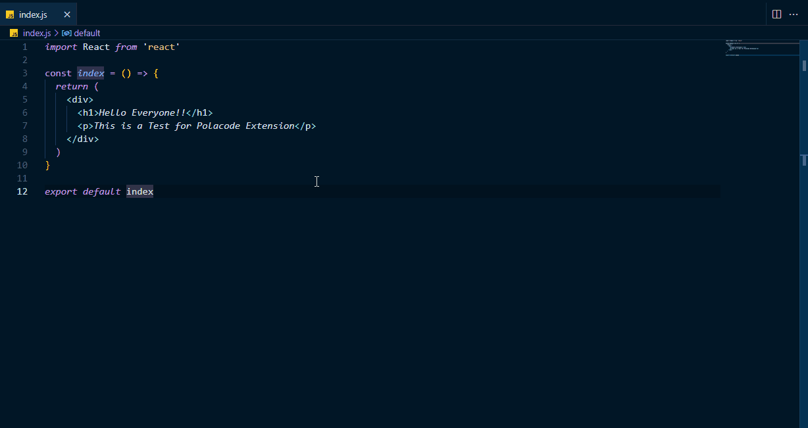

VS Code is one of the most widely used and loved IDE, developers all around the world use to build software. Whether you're a beginner who is writing basic HTML or professional building desktop applications, chances are you might be one of the many developers who use VS Code.

There are thousands of contributors who create useful extensions to give the already powerful VS Code, **superpowers**. These extensions can be useful in many ways, from being productive, to add additional functionalities to VS Code, to even change the look and feel of it.

Here is my recommended list of the best extensions for VS Code. *(Listed in no particular order)*
> ***Note***: I have only included ***'general purpose extensions'*** that can be used for most types of workflows. In the future I'm hoping to post language specific extensions that I use, so stay tuned for that.😊

# 1. [Visual Studio IntelliCode](https://marketplace.visualstudio.com/items?itemName=VisualStudioExptTeam.vscodeintellicode)

**Visual Studio IntelliCode** is an AI-powered productivity tool built by Microsoft for VS Code as an enhancement for the existing ***IntelliSense***. It provides **contextual** code completion/autocompletions for VS Code. **[IntelliCode's](https://marketplace.visualstudio.com/items?itemName=VisualStudioExptTeam.vscodeintellicode)** recommendations are based on practices developed in thousands of high quality, open-source projects on GitHub each with high star ratings and it's machine learning model is constantly learning through these open-source projects to provide 'context-based' code completions rather than an *alphabetical* or *recently used* list. This saves you a lot of time as you will not need to cycle through a list of suggestions, *and instead the most relevant one will be at the top*. I have been using this  extension for a long time and has saved me lot of time. I would definitely recommend you check this one out.

Visual Studio IntelliCode Demo

# 2. [Path IntelliSense](https://marketplace.visualstudio.com/items?itemName=christian-kohler.path-intellisense)

This is a similar extension to the previous one, that provides autocompletion functionality for filenames. This could be very handy if your workflow requires you to import a lot of *in-project* files.

Path IntelliSense Demo

# 3. [Markdown All in One](https://marketplace.visualstudio.com/items?itemName=yzhang.markdown-all-in-one)

Writing documentation is an important part in a developer's workflow. And the most common way of writing documentations or even articles/blogs, is using **Markdown**. [The Markdown All in One extension](https://marketplace.visualstudio.com/items?itemName=yzhang.markdown-all-in-one) makes the process of writing in markdown more enjoyable and productive, by providing keyboard shortcuts, TOC, autocompletions and many more. I find this extension to be very useful to me as it makes my *writing workflow*  to be efficient and fast.

Markdown All in One Demo

# 4. [Prettier](https://marketplace.visualstudio.com/items?itemName=esbenp.prettier-vscode)

Prettier is an *opinionated* code formatter that enforces a consistent style throughout a project. This is especially useful if there are multiple people working on a single project and want a consistent style to your code.

Prettier CSS Demo

Prettier React Demo

> ***Quick Tip***: Enable Format on Save. This feature in VS Code formats a file after you save it, with a code formatter. You can do this by opening the settings (`Ctrl` + `,`) and then search for `Format on Save` and check the box in front of it and make sure to set `Format on Save mode` to `file`.

# 5. [Auto Rename Tag](https://marketplace.visualstudio.com/items?itemName=formulahendry.auto-rename-tag)

This extension does exactly what it says in it's name, it automatically renames paired tags. This is a very simple, yet very useful extension.

Auto Rename Tags Extension Demo

# 6. [Colorize](https://marketplace.visualstudio.com/items?itemName=kamikillerto.vscode-colorize)

This is an extension that can be used to visualize colors in VS Code. It can be used for **cross browser colors** *(red, green, blue)*, **hexa**, **rgba** or even **argb**.

Colorize CSS Demo

Colorize CSS-in-JavaScript (Styled-Components) Demo

> **Note:-**If you want to add **colorize** to other languages, you just have to include it in your settings.json file. For example:
> 

# 7. [GitLens](https://marketplace.visualstudio.com/items?itemName=eamodio.gitlens)

GitLens is a feature-rich extension for VS Code that allows you to manage git in a whole new level.
GitLens is a great tool for understanding every line of code, you can know who, when or why it was changed. It also allows you to jump through the history of the entire codebase or even check the history based on commits.

GitLens has so many other cool features, going over them would need a separate article. So for now take a look at their [documentation](https://gitlens.amod.io/#features) to grok all the features. If you are a person using git for source control, this would be a very handy tool for you.

# 8. [Polacode](https://marketplace.visualstudio.com/items?itemName=pnp.polacode)

Polacode is an extension that creates beautiful pictures of your code that can be shared easily with others. The best thing about Polacode is that when creating the picture, it retains the existing theme, fonts and renders them in an awesome way.

Polacode Demo

# 9. Themes

You can also change the look and feel of VS Code with extensions. It can be overwhelming to pick from the massive amount of themes to choose, so here are my favourites:
- [Night Owl](https://marketplace.visualstudio.com/items?itemName=sdras.night-owl) *(This is the theme that I use)*
- [Material Theme](https://marketplace.visualstudio.com/items?itemName=Equinusocio.vsc-material-theme)
- [Bearded Themes](https://marketplace.visualstudio.com/items?itemName=BeardedBear.beardedtheme)
- [Dracula Official Theme](https://marketplace.visualstudio.com/items?itemName=dracula-theme.theme-dracula)
- [Tokyo Night Theme](https://marketplace.visualstudio.com/items?itemName=enkia.tokyo-night)

# 10. Icons

You can also change the default icons. It is the same thing with icons, a lot to choose from, so here are my picks:
- [Material Icon Theme](https://marketplace.visualstudio.com/items?itemName=PKief.material-icon-theme) *(This is the one that I use)*
- [Material Theme Icons](https://marketplace.visualstudio.com/items?itemName=Equinusocio.vsc-material-theme-icons)
- [VS Code Icons](https://marketplace.visualstudio.com/items?itemName=vscode-icons-team.vscode-icons)
