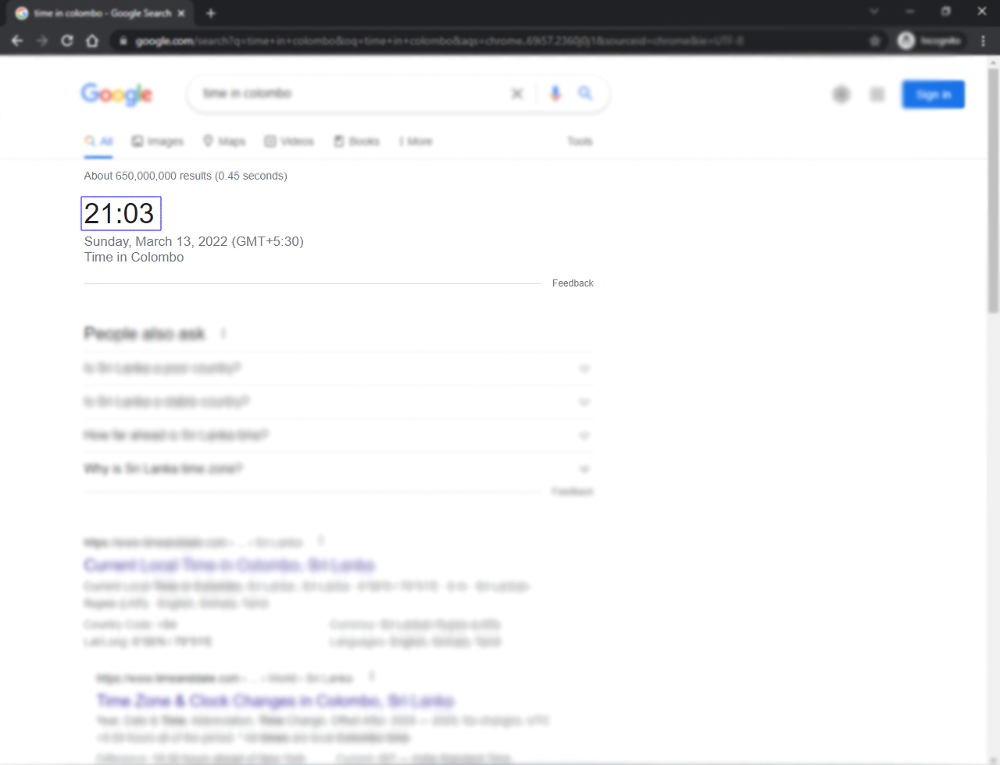
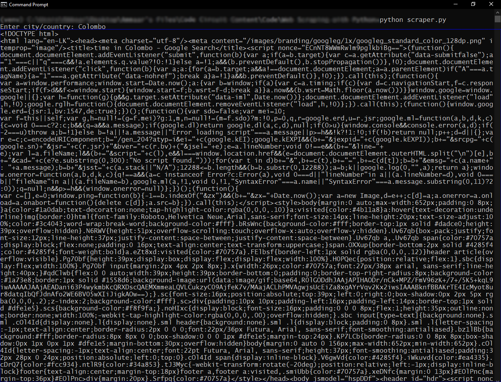
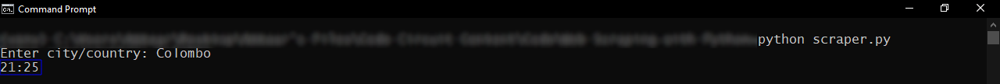

Nowadays, there is an incredible amount of valuable data on the internet that can be used for any field of advanced research or personal interest. In order garner these information, we use a technique called **Web Scraping**.

# What is Web Scraping?
Web Scraping is the process of extracting specific information from the internet. Web scraping is useful as it reduces the amount of time wasted by searching, scrolling, clicking, waiting for the website while performing manual scraping.

Usually the term 'web scraping' *and the one we are going to be performing today*, involves some kind of automation, so some websites might not like the automatic scraping of data from their sites, while other websites don't mind.

When web scraping for purely educational purposes, you are most unlikely to fall into any problems. However, when performing web scraping, do your own research and make sure that you're not violating any terms of the targeting website just for your own safety.

> **Generally make sure to check a website's terms of service or policy before performing any type of automation.**

# Why Web Scraping is Used?
As mentioned above, web scraping is used to extract data from the internet. You might use these data for numerous reasons, some of the most common use cases are:
- **Building price comparison tools**
- **Machine Learning**
- **Social Media Scraping**
- **Email Gathering**
- **Analytic tools**

You might even be using it for just copying certain data from a website and pasting into a text file.

# What we are going to build today
In this tutorial we will be building a simple scraper that will extract the time result from a google search for a particular city/country. 



The full source code for today's tutorial is [here](https://github.com/ammaaraslam/google-time-scraper).

# Getting Started
To start off, make sure you have Python 3 installed on your machine.
To do so, type the following command in your terminal:
```sh
# on Windows and Linux:
python --version

# on MacOS:
python -version
#or
python3 -version
```
If you get an output similar to the following, you're good to go.

```sh
Python 3.10.2
```
> If you haven't installed Python already, check out this [Tutorial on RealPython](https://realpython.com/installing-python/).

Next create a folder, navigate into that folder and install the following libraries:

Firstly, I will be installing [virtualenv](https://virtualenv.pypa.io/en/latest/), a tool to create isolated virtual environments in Python. This library is not necessary for you to follow along this tutorial, but it is good to have separate environments for different projects.

```sh
# install virtualenv if you already haven't
pip install virualenv

# create a virtual environemnt inside our project
virtualenv venv

# activate the virtual environment
# on Windows:
.\venv\Scrips\activate
# on Linux and MacOS:
source venv/bin/activate

# to deactivate, type:
deactivate

```
Next install [request](https://docs.python-requests.org/en/latest/) and [beautifulsoup4](https://beautiful-soup-4.readthedocs.io/en/latest/):
```sh
pip install requests bs4
```

# Implementing Web Scraping
First of all, in your project folder, create a new python file, you can name it anything you like, I'm gonna name mine as `scraper.py`.

Now in your python file, import the installed libraries.

```py
import requests
import bs4
```

Then create a variable to store the name of the city and the URL of a google search for that city:
```py
# variable to store the search term
city = str(input('Enter search city: '))

# variable to store the url of a google search for our query
url = "https://google.com/search?q=time+in+" + city
```

Now we use the variables to fetch the data and store it in a string format:
```py
# store the result of requests.get(url) in a variable
request_result = requests.get(url)

# Creating soup from the fetched result of our request
soup = bs4.BeautifulSoup(request_result.text "html.parser")
print(soup)

```
Now type the following command to run the above code:
```sh
python scraper.py
# or
python3 scraper.py
```
You must get an output similar to the following:



# Extracting Only Necessary Data from Our Scraper

If we execute the code that we wrote, we get an output with unnecessary information that we cannot fully understand. So, to satisfy our need we want to extract only the data we need. For this tutorial we want only the time from the search result.

So instead of returning all the HTML we want the scraper to only return only the time element.

In order to do this, we inspect the element we want to extract to get either the class, id or type of that element. In our case, to extract the time from the google search we have to extract only the element with the class name `BNeawe`.

Therefore, we write the following code:
```py
# Finding time element from the google search.
# The time is stored inside the class "BNeawe".
time = soup.find("div", class_='BNeawe').text

print(time)
```
And now if we run the script, we get the desired output in our terminal:



# Conclusion
This tutorial was just a very basic introduction to web scraping with Python and BeautifulSoup. There are so many features BeautifulSoup offers that you can use for advanced projects. You can also use Selenium which is a really powerful browser automation tool along with BeautifulSoup to create something truly remarkable.

In the future I might make some projects with these two libraries and write tutorials on how to build them, so stay tuned for that. And again, the full source code for today's tutorial can be found on my [GitHub](https://github.com/ammaaraslam/google-time-scraper).
