Python is a very popular high-level, general-purpose programming language, created by [Guido van Rossum](https://twitter.com/gvanrossum). Python can be  used for a wide variety of applications, some of these applications include, web development, machine learning, automation or scripting, software testing/prototyping.

In this tutorial we'll be going through, how you can install Python3 *(The Latest version)* on Windows.

> **Note:** Since I'm a Windows user, in this tutorial I'll only be covering how to install Python3 on Window, but if you want to install or update Python on MacOS, [check this tutorial by Flavio Copes](https://flaviocopes.com/python-installation-macos/) and if you are a Linux user, [check out this tutorial on opensource.om](https://opensource.com/article/20/4/install-python-linux)

# Let's install Python

There are many different ways you can install Python on Windows. Today we'll be installing python through the official [Python Website](https://python.org), the way I installed it as a beginner.

So without further ado, let's get started.

## Step 1: Check for available installation of python.

To start off, check your system for any previous installations of python. To do so, enter the following command on Command Prompt or PowerShell.

```shell
python --version
```

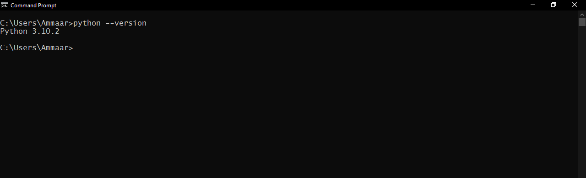

If you get an output like the above, then you already have python installed on your machine. But if it is an older version or you want to update it to the latest version, check out my tutorial on [How to Update Python on Windows](/tutorial/how-to-update-python-on-windows).

If you don't get an output as the above and instead get an error message, don't panic, it means you don't have python installed. Follow along, to install python.

## Step 2: Download the latest Python Executable

Now, to download the latest executable installer of python, do the following in you browser.

- Firstly, navigate to the [Official Python Downloads Page for Windows](https://python.org/downloads/windows)
  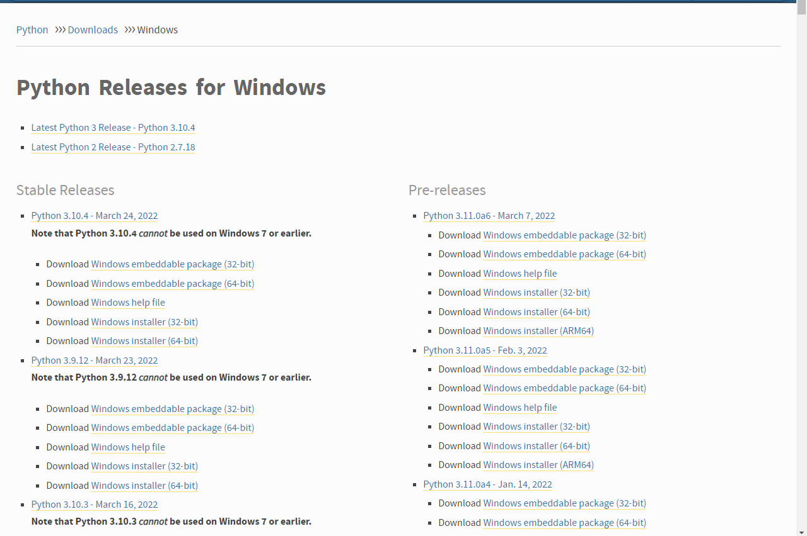

- Scroll to your desired version of python *(I recommend the latest)* and depending on your system, click on either of the two Windows Installer links *(34-bit or 64-bit)* under the version you are looking for.
  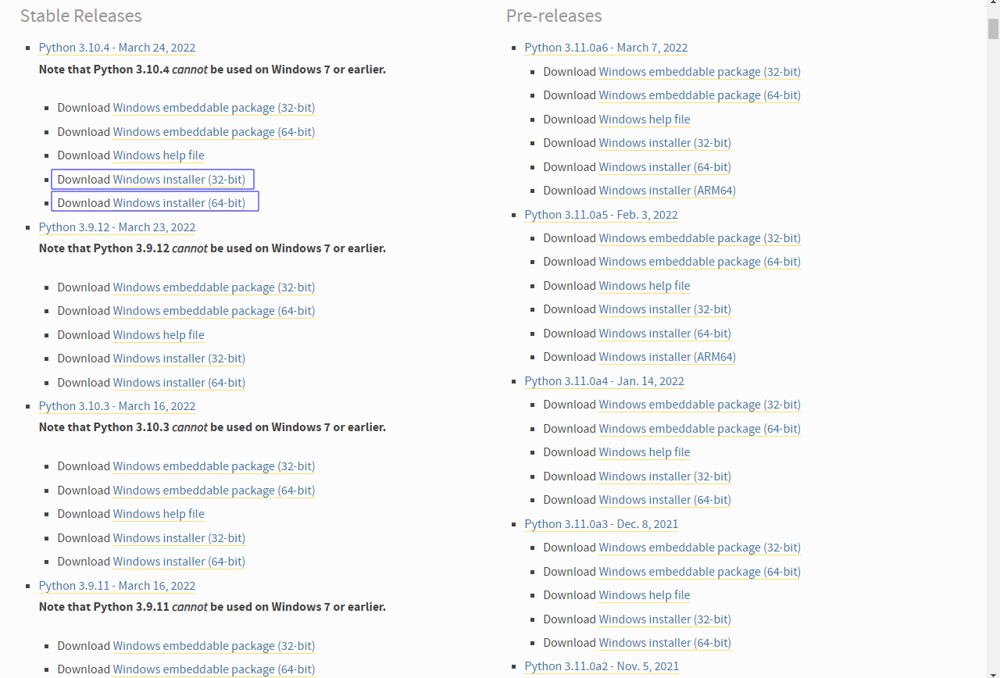

## Step 3: Run the Downloaded Executable

After you downloaded the installer successfully, run it and you will be presented with the following window:

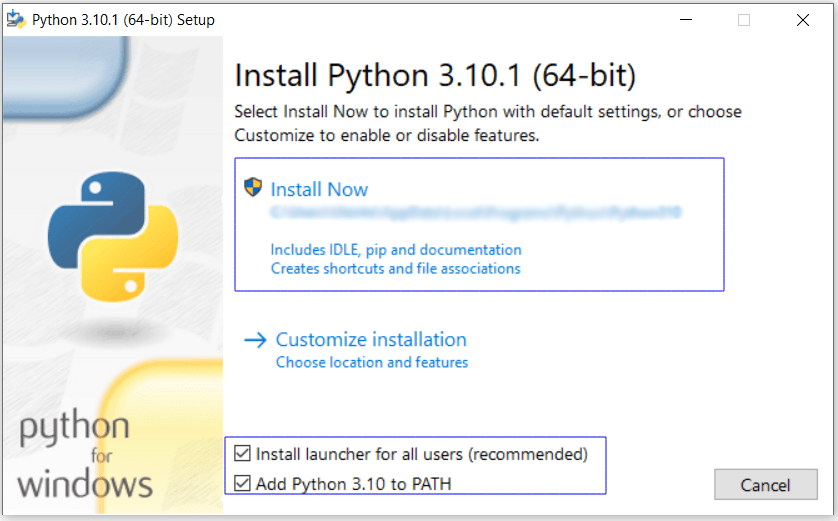

Once you are prompted with the above window, make sure the two boxes labelled **Install launcher for all users (recommended)** and **Add Python x.x to path** are checked and then click on **Install Now**.

After the Installation is complete, you will be prompted with an installation successful window and a **Disable path length limit** option. Selecting this option does not affect your system settings instead it will resolve potential name length issues that may arise.
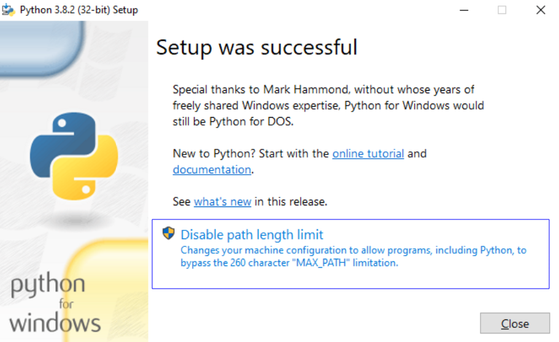

## Step 4: Verify Python3 Installation

Now that you have successfully installed python, let's verify the installation. To do so, open Command Prompt/PowerShell and enter the following command:

```shell
python
```

The output should be similar to the following:
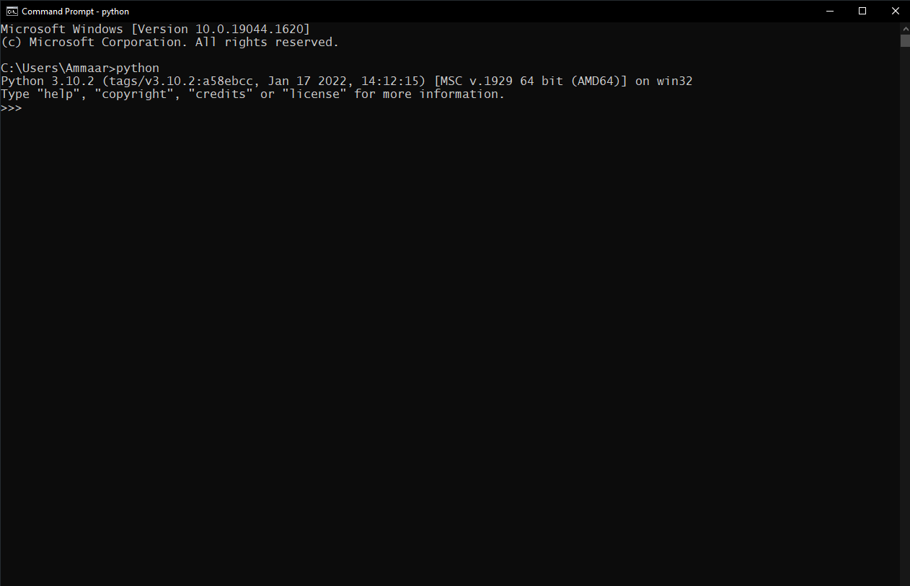

> **Note:** You can also verify the installation by entering `python --version` on your terminal. The output should be similar to the following.

If you installed an older version of python get an output like the one below:

```shell
'python' is not recognized as an internal or external command, operable program or batch file
```

You might want to add python to your system path. To add python to your system path, follow the below steps:

- Firstly press the `Windows Key` + `r`, then type in **sysdm.cpl**, this opens the **System Properties** window.

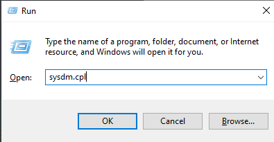

- Then, navigate to the **Advanced** tab and select **Environment Variables**. 

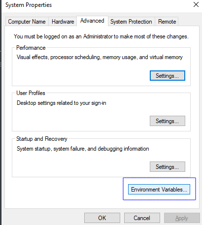

- Then under **System Variables**, select the **Path** variable. 

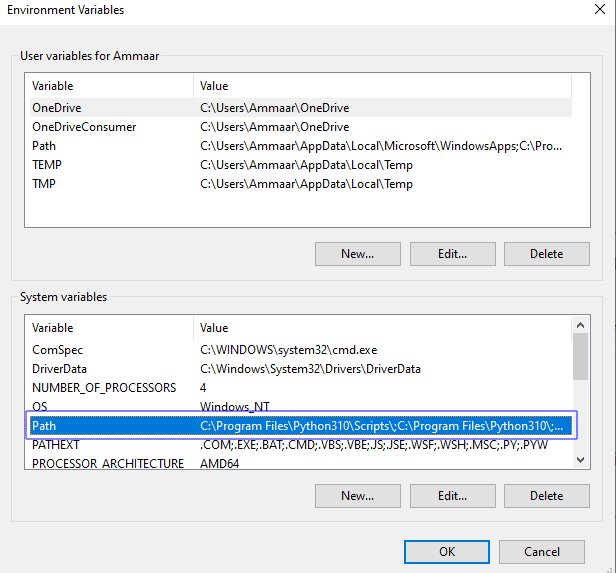

- Click **Edit**. 
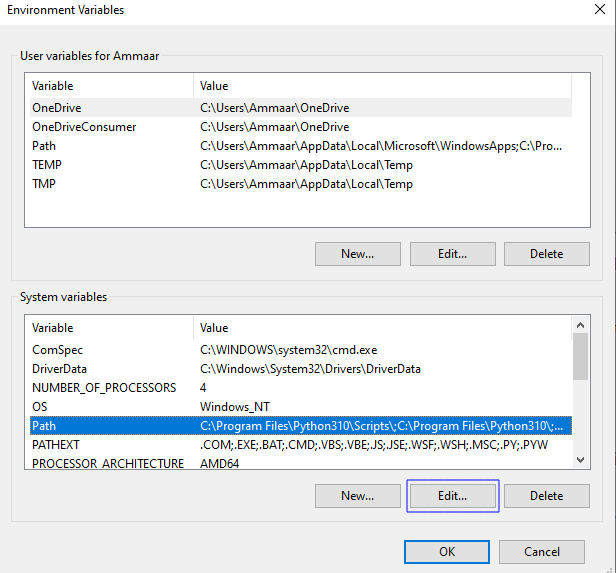

- Then click on **New** to add Python to the Path. 

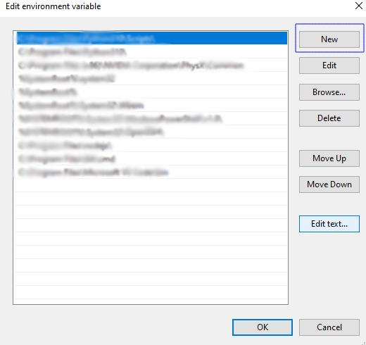

- Then type in the path to the python.exe file. *(If you followed this tutorial, your path must be **'C:\Program Files\Python310\'**)* 
  
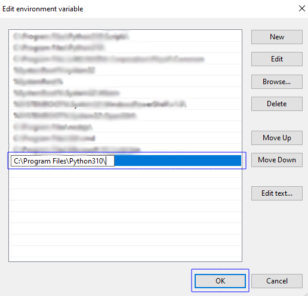

- Then click **OK**, **OK**, **Apply** and finally **OK**

- And now if you verify this by entering `python` on your terminal, you must get the desired output.

# Conclusion

Congratulations! You have successfully installed Python onto your Windows Machine. If you had any problems following this tutorial, shoot me a tweet [@itsammaar_7](https://twitter.com/itsammaar_7).
If you want to update your current Python version, check my tutorial on [How to update Python Version on Windows](/tutorial/how-to-update-python-on-windows).

Hope this tutorial helped you install Python easily, stay tuned for more!!😉