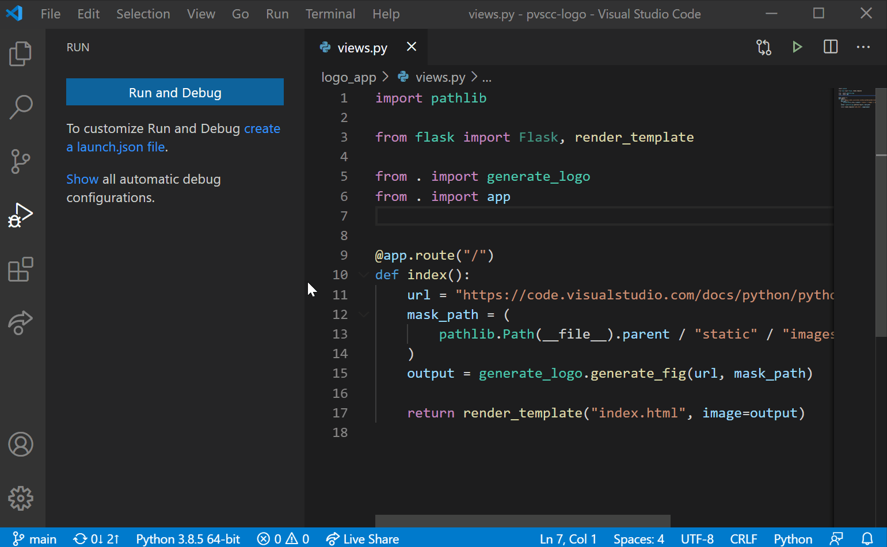
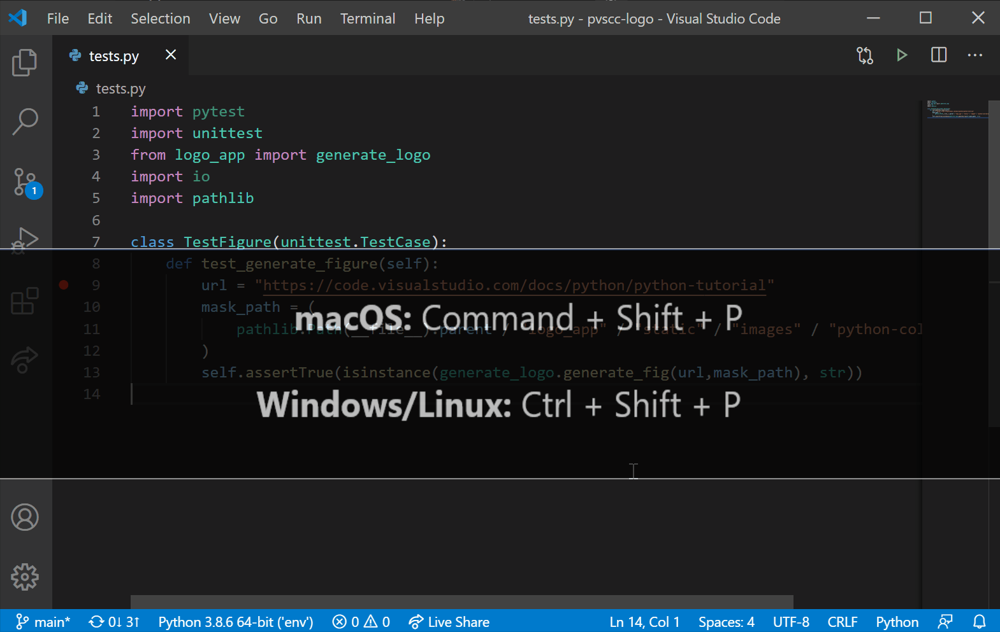
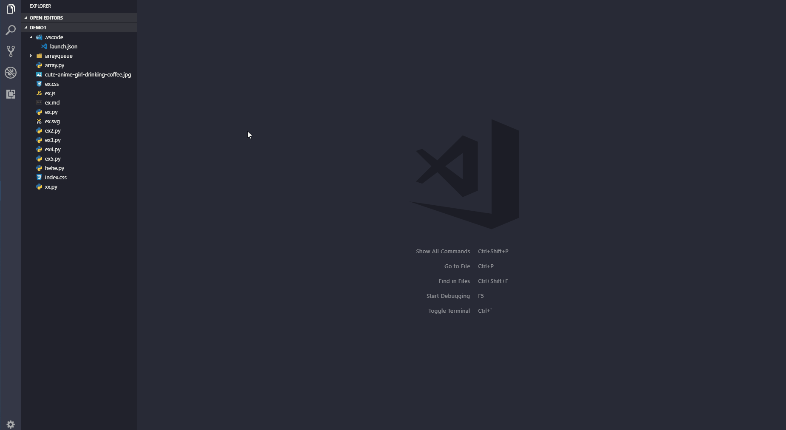
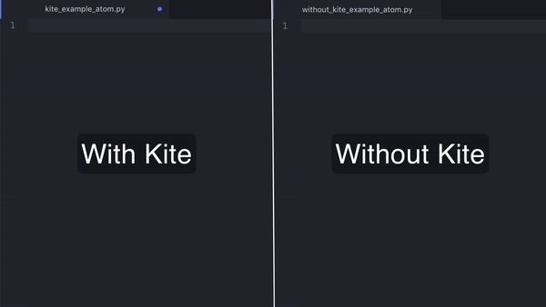
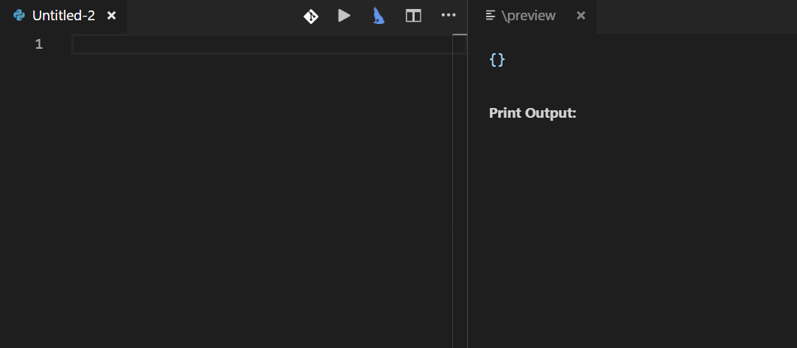
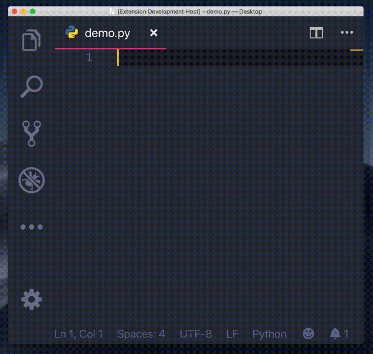
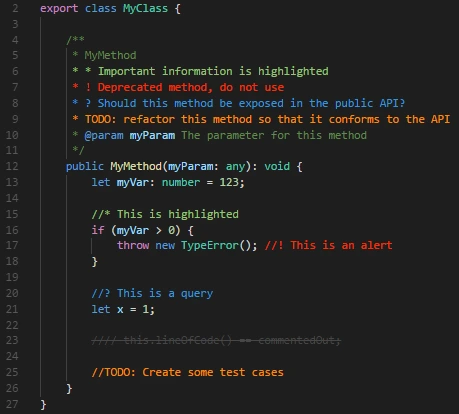
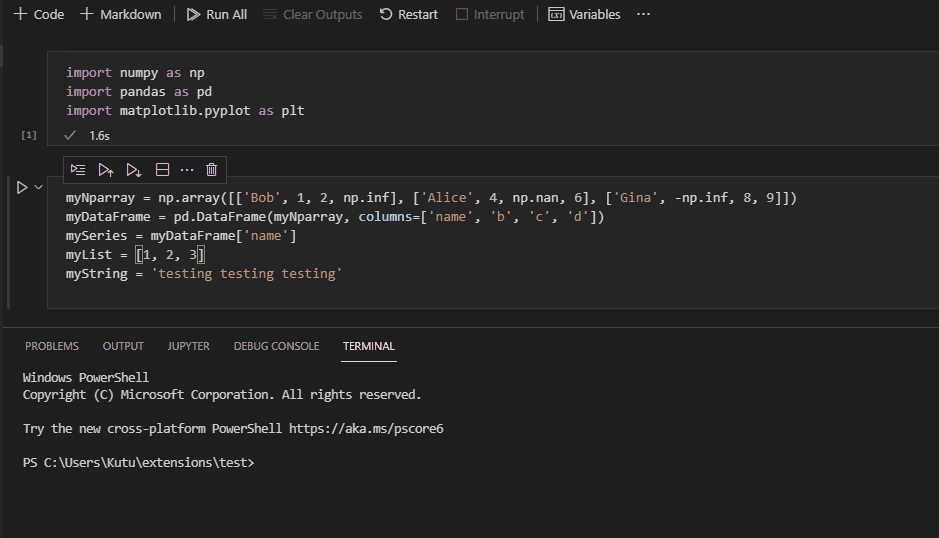
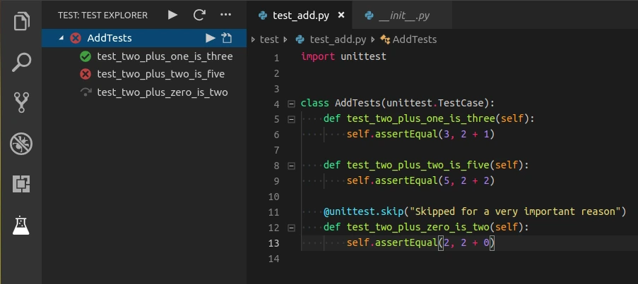

If you are a [Python](/topics/python) programmer who uses [VS Code](/topics/vs-code), VS Code will suggest some general extensions to make it easy for you to program in python. Apart from these, there many other noteworthy extensions available in the VS Code Marketplace to make python programming easy and fun.

In my [Best VS Code Extensions for Developers](/article/best-vs-code-extensions-for-developers) article, I shared some of the more general purpose extensions that I recommend to use as a developer. In today's article, I'll be sharing my list of favourite VS Code extensions for Python programming. So without further ado, let's dive in.

# 1. [Python Extension for VS Code](https://marketplace.visualstudio.com/items?itemName=ms-python.python)
This a feature-rich extension for the Python Programming Language that includes features such as IntelliSense (Pylance), linting, debugging, code navigation, code formatting, refactoring, variable explorer, test explorer, and more. This extension is usually suggested or automatically installed by VS Code when you have a `.py` file open.

Python Extension for VS Code Demo

Python Extension for VS Code Demo 2

# 2. [Python Preview](https://marketplace.visualstudio.com/items?itemName=dongli.python-preview)
Python Preview is an extension that adds visual debugging of Python language in VS Code. It is very simple to use and makes writing python code so much easier since it helps you visualize what you're trying to build.

Python Preview Demo

# 3. [Python Snippets](https://marketplace.visualstudio.com/items?itemName=frhtylcn.pythonsnippets)
This a very simple yet very productive extension that provides almost all kinds of snippets when programming with python. Since it gives you examples for each and every piece of code snippet, you can also learn the things that you might not already know, from this extension.

Python Snippets Demo

# 4. [Kite](https://marketplace.visualstudio.com/items?itemName=kiteco.kite)
Kite is an AI-powered programming assistant that helps you write code faster inside Visual Studio Code. Kite helps you write code faster by saving you keystrokes and showing you the right information at the right time.

Kite works for all major programming languages, including Python.

Kite Demo

# 5. [AREPL](https://marketplace.visualstudio.com/items?itemName=almenon.arepl)
AREPL is an extension that automatically evaluates python code in real-time. As you start to code, AREPL will constantly run and check your code in real-time. This is especially useful as it points out errors as you are typing.

AREPL Demo

# 6. [autoDocString - Python DocString Generator](https://marketplace.visualstudio.com/items?itemName=njpwerner.autodocstring)
A VS Code extension that generates clear and concise documentation for your methods, classes and functions. It provides multiple docstring formats including: Google, Sphinx, Numpy, docBlockr, One-line-sphinx and pep257 and has support for args, kwargs, decorators, errors, and parameter types.

autoDocString Demo

# 7. [Python Indent](https://marketplace.visualstudio.com/items?itemName=KevinRose.vsc-python-indent)
Indentation plays an important role in the Python programming language, and if you mess an indentation, your code might not work. This can be really frustrating ☹. VS Code supports some functionality and has improved it over time, but there times where you press enter and the cursor goes to far-left of the editor. This is where Python Indent comes into play. This extension provides a basic functionality, which is indenting our code without needing to check the cursor position every time we press enter. I would really recommend you check out this extension.

Python Indent Demo

# 8. [Better Comments](https://marketplace.visualstudio.com/items?itemName=aaron-bond.better-comments)
The Better Comments extension will help you create more human-friendly comments in your code.
With this extension, you will be able to categorize your annotations into:
- Alerts
- Queries
- TODOs
- Highlights
- Commented out code can also be styled to make it clear the code shouldn't be there
- Any other comment styles you'd like can be specified in the settings

Better Comments Demo

# 9. [Jupyter](https://marketplace.visualstudio.com/items?itemName=ms-toolsai.jupyter)
An extension that allows you to code, run and analyze Jupyter Notebooks in VS Code. You can use all the goodies that you love in VS Code to edit Jupyter Notebooks.

Jupyter Demo

# 10. [Python Test Explorer](https://marketplace.visualstudio.com/items?itemName=LittleFoxTeam.vscode-python-test-adapter)
This extension allows you to run your Python Unittest, Pytest or Testplan tests with the Test Explorer UI. In python, unit testing plays a key role when writing good code, so a tool like this is a must-have for your IDE.

Python Test Explorer Demo

# Conclusion

Well that's it, this has been my [Top 10 VS Code Extensions for Python](/article/top-10-vs-code-extensions-for-python), remember this is only **my** recommendation, there tons more on the Visual Studio Marketplace.

If you found this article useful, I wrote an article sharing my [Best VS Code Extensions for Developers](/article/best-vs-code-extensions-for-developers), where I include some *'general purpose extensions'*, so check that out too.🤩